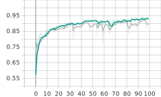
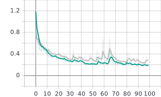

# Paseos virtuales en Google Street View

_For the english version, [click here](README.md)._

Durante la cuarentena que estamos pasando debido a la pandemia del COVID-19 nuestro derecho a caminar libremente por la
calle se ha visto mermado en pos del bien común. Muchas fronteras están cerradas y viajar está casi totalmente prohibido
en la mayoría de países.

_Virtual Walks_ es un proyecto que usa modelos de Estimación de Pose con redes neuronales LSTM para simular paseos por 
Google Street View. Para la estimación de la pose se ha adaptado el modelo [PoseNet](https://www.tensorflow.org/lite/models/pose_estimation/overview)
, y la detección de acciones se ha realizado con celdas LSTM desarrolladas sobre [TensorFlow 2.0](https://www.tensorflow.org/).

Este proyecto es capaz de simular paseos en todas las calles del mundo en las que haya [Google Street View](https://www.google.com/intl/es_ES/streetview/).

Tensorflow 2.0, Selenium y Python 3.7 son las tecnologías principales utilizadas en este proyecto.

## Funcionamiento

PoseNet ha sido combinado con un modelo LSTM  para inferir la acción que la persona está haciendo. Una vez que se ha detectado
la acción, ésta se pasa al controlador, que interactúa con Google Street View.

1. Una ventana de Selenium Firefox se abre.
1. Utilizando la webcam, el sistema toma fotos de la persona, que hará una de las cuatro acciones permitidas

    * Estar quieto
    * Andar
    * Girar a la derecha
    * Girar a la izquierda

1. Para cada foto, PoseNet infiere la posición de las articulaciones principales.
1. Se hacen grupos de cinco frames, empezando por un frame que debe cumplir ciertos umbrales de confianza en las articulaciones.
A partir de la primera imagen, algunas articulaciones son inferidas entre frames contiguos.
1. Cada grupo de frames se pasa a un modelo de red recurrente con una red neuronal que predice la acción.
1. La acción predicha se envía al controlado, que interactúa con Google Street View para moverse acorde a ella.

Ahora mismo hay otro modelo que puede ser utilizado para ejecutar este programa. En lugar de una LSTM, se calcula la velocidad 
de las articulaciones en cada uno de los cinco frames y se envía a un modelo PCA y posteriormente a una RNN, que predice la acción.
El modelo por defecto es el LSTM ya que consideramos que es metodológicamente más correcto y hemos obtenido mayor precisión.

Como la predicción podría ser mucho más rápida que la velocidad media de un paseo (dependiendo de las especificaciones
del ordenador en el que se está ejecutando), una acción solo puede ser ejecutada cada 0.5 segundos. Este parámetro es 
modificable en el archivo de configuración.

## Ejemplo de caso de uso

Como se puede observar en la imagen, el esqueleto se infiere de la imagen y la acción es predicha y ejecutada.


Un ejemplo en detalle se puede observar en el siguiente vídeo:
<video src="./readme_resources/output_git.mp4" width="320" height="200" controls preload></video>

## Instalación y uso
Recuerda que se necesita una webcam para utilizar este programa.

Clona el repositorio git

```
git clone https://github.com/Moving-AI/virtual-walk.git
```

Instala las dependencias

```
pip install requirements.txt
```

Descarga los modelos ejecutando el archivo [download_models](./download_models.py). Este archivo descargará los modelos 
de PoseNet (MobileNet y ResNet con los dos tipos de stride, 16 y 32), LSTM, PCA, scaler y red neuronal. El link para
descargar los modelos por separado puede encontrarse más abajo.
```
cd virtual-walk
python3 download_models.py
```

Finalmente, puedes ejecutar [execute.py](./execute.py) para probarlo.

```
python3 execute.py
```

Consideraciones a tener en cuenta:
- Nuestra experiencia utilizando el modelo nos dice que un ambiente con poca luminosidad se prefiere a otro muy luminoso.
- El sistema es sensible a la posición de la webcam.

En general, una posición similar a la del GIF debería ser usada.

#### Links a nuestros modelos
- [LSTM](https://drive.google.com/uc?export=download&id=1JydPMY58DVZr3qcZ3d7EPZWfq__yJH2Z)
- [Scaler](https://drive.google.com/uc?export=download&id=1eQUYZB1ZTWRjXH4Y-gxs2wsgAK30iwgC)
- [PCA](https://drive.google.com/uc?export=download&id=1cYMuGlfBdkbH6wd9x__1D07I64VA94wE)
- [Feed-forward neural network](https://drive.google.com/uc?export=download&id=1dn51tNt96cWesufjCRtuQJQd2S3Ro6fu)

### Entrenamiento

El apartado de entrenamiento es el más débil en este proyecto debido a la falta de datos de entrenamiento y capacidad
de procesamineto. Nuestros datos iniciales consistieron en 40 minutos de grabaciones. En cada vídeo una persona aparecía
ejecutando una acción específica durante un período de tiempo. Como se discutirá más adelante, nuestros modelos tienden a 
sobreajustar a pesar de tener un sistema funcional. Un ejemplo de los datos de entrenamiento se puede observar en la 
siguiente image:

 

Los modelos que hemos entrenado pueden ser descargados ejecutando el archivo [download_models](./download_models.py).
En las imágenes se muestra el proceso de entrenamiento:

  |  
-------------------------|------------------------

Para entrenar otro modelo LSTM, el repositorio cuenta con la clase [DataProcessor](./source/dataprocessing/__init__.py).
Puede procesar los vídeos localizados en una carpeta, leyendo los frames válidos de un archivo labels.txt y generando un 
CSV con los datos de entrenamiento. Este archivo puede ser utilizado en [train.py](./train.py) para generar un nuevo modelo
LSTM. La localización de este modelo se pasaría a la clase [WebcamPredictor](./source/webcam_predictor.py) y el sistema 
localizaría este nuevo modelo.

## Próximos pasos

- Generar más datos de entrenamiento. En este proyecto se ha tratado de conseguir el Mínimo Producto Viable y la
robustez nunca ha sido el objetivo principal. Como se puede ver en los resultados del entrenamiento, parece que el modelo
no sobreajusta. Sin embargo, los datos de entrenamiento y test son muy similares porque en los vídeos aparecen personas 
haciendo acciones en bucle. De esta forma, suponemos que el modelo tendrá un sobreajuste subyacente que solo podría ser
detectado con más datos de entrenamiento en condiciones de iluminación y posición diferentes.

- Girar a izquierda y derecha no son predichos con la misma precisión, a pesar de tratarse de acciones simétricas. Una
reflexión especular de las coordenadas podría ser usada para dotar al modelo de más consistencia a la hora de predecir giros.

## Autores

* **Javier Gamazo** - [Github](https://github.com/javirk). [LinkedIn](https://www.linkedin.com/in/javier-gamazo-tejero/)

* **Gonzalo Izaguirre** - [Github](https://github.com/gontxomde). [LinkedIn](https://www.linkedin.com/in/gizaguirre/)

## License

This project is under MIT license. See [LICENSE](LICENSE) for more details.

## Agradecimientos

- [@atomicbits](https://github.com/atomicbits) por el [repositorio](https://github.com/atomicbits/posenet-python/)
con las herramientas utilizadas para descargar los modelos TFJS de PoseNet.
- [@tensorflow](https://github.com/tensorflow/) por los modelos [Posenet](https://github.com/tensorflow/tfjs-models/tree/master/posenet).
- [@patlevin](https://github.com/patlevin/tfjs-to-tf) por las herramientas utilziadas para crear una sesión en Python a partir
de un grafo.
- [@ajaichemmanam](https://github.com/ajaichemmanam/simple_posenet_python) por la ayuda proporcionada.
- [@felixchenfy](https://github.com/felixchenfy) y su repositorio [Realtime-Action-Recognition](https://github.com/felixchenfy/Realtime-Action-Recognition)
por la inspiración que hayamos podido tomar de ahí. 